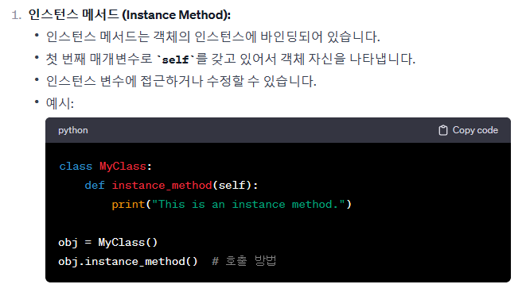
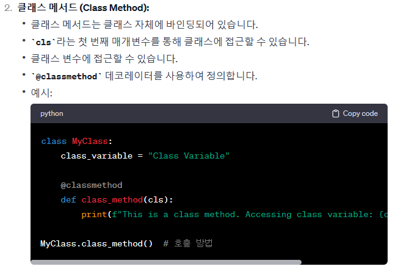
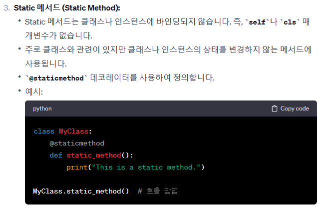

# OOP

## 객체 지향 프로그래밍

1. 프로그램을 데이터와 절차로 구성하는 방식의 프로그래밍 패러다임
2. 데이터와 해당 데이터를 조작하는 메서드를 하나의 객체로 묶어 관리하는 방식의 프로그래밍 패러다임

### 절차 지향 프로그래밍의 특징

- 데이터와 해당 데이터를 처리하는 함수가 분리되어 있으며, 함수 호출의 흐름이 중요
- 코드의 순차적인 흐름과 함수 호출에 의해 프로그램이 진행
- 실제로 실행되는 내용이 무엇인가가 중요
- 데이터를 다시 재사용하는것보다는 처음부터 끝까지 실행되는 결과물이 중요한 방식

|절차 지향|객체지향|
|:--:|:--:|
|데이터와 해당 데이터를 처리하는 함수가 분리|데이터와 해당 데이터를 처리하는 메서드를 하나의 객체로 묶음
|함수 호출의 흐름이 중요|객체 간 상호작용과 메시지 전달이 중요|

## 객체

클래스에서 정의한 것을 토대로 메모리에 할당된 것   
'속성'과 '행동'으로 구성된 모든 것

### 객체의 특징

- 타입 : 어떤 연산자와 조작이 가능한가?
- 속성 : 어떤 상태(데이터)를 가지는가?
- 조작법 : 어떤 행위(함수)를 할 수 있는가?

## 클래스

파이썬에서 타입을 표현하는 방법   
-> 객체를 생성하기 위한 설계도   
-> 데이터와 기능을 함께 묶는 방법을 제공

### 클래스 활용

1. 생성자 함수
    - 객체를 생성할 때 자동으로 호출되는 메서드
    - init이라는 이름의 메서드로 정의되며, 객체의 초기화를 담당
    - 생성자 함수를 통해 인스턴스를 생성하고 필요한 초기값을 설정

2. 인스턴스 변수
    - 인스턴스마다 별도로 유지되는 변수
    - 인스턴스마다 독립적인 값을 가지며, 인스턴스가 생성될 때마다 초기화됨

3. 클래스 변수
    - 클래스 내부에 선언된 변수
    - 클래스로 생성된 모든 인스턴스들이 공유하는 변수

4. 인스턴스 메서드
    - 각각의 인스턴스에서 호출할 수 있는 메서드
    - 인스턴스 변수에 접근하고 수정하는 등의 작업을 수행

    

## 매서드 종류

1. 인스턴스 메서드   
    클래스로부터 생성된 각 인스턴스에서 호출할 수 있는 메서드   
    -> 인스턴스의 상태를 조작하거나 동작을 수행

    ### 구조
    - 클래스 내부에 정의되는 메서드의 기본
    - 반드시 첫 번째 매개변수로 인스턴스 자신(self)을 전달받음

    ### 생성자 메서드
    인스턴스 객체가 생성될 때 자동으로 호출되는 메서드   
    -> 인스턴스 변수들의 초기값을 설정

    

2. 클래스 메서드

    클래스가 호출하는 메서드   
    -> 클래스 변수를 조작하거나 클래스 레벨의 동작을 수행

    - @classmethod 데코레이터를 사용하여 정의
    - 호출 시, 첫번째 인자로 호출하는 클래스가 전달됨

    

3. 스태틱(정적) 메서드

    클래스와 인스턴스와 상관없이 독립적으로 동작하는 메서드   
    -> 주로 클래스와 관련이 있지만 인스턴스와 상호작용이 필요하지 않은 경우에 사용

    ### 구조
    - @staticmethod 데코레이터를 사용하여 정의
    - 호출 시 필수적으로 작성해야 매개변수가 없음
    - 즉 객체 상태나 클래스 상태를 수정할 수 없으며 단지 기능만을 위한 메서드로 사용

    

## 정리

1. 인스턴스 메서드

    인스턴스의 상태를 변경하거나, 해당 인스턴스의 특정 동작을 수행

2. 클래스 메서드
    인스턴스의 상태에 의존하지 않는 기능을 정의   
    클래스 변수를 조작하거나 클래스 레벨의 동작을 수행

3. 스태틱 메서드
    클래스 및 인스턴스와 관련이 없는 일반적인 기능을 수행

4. 각자의 역할
    - 클래스가 사용해야 할 것   
        클래스 메서드   
        스태틱 메서드
    
    - 인스턴스가 사용해야 할 것   
        인스턴스 메서드

5. 클래스가 할 수 있는 것   
    클래스는 모든 메서드를 호출  할 수 있음   
    하지만 클래스는 클래스 메서드와 스태틱 메서드만 사용하도록 한다

6. 인스턴스가 할 수 있는 것
    인스턴스는 모든 메서드를 호출 할 수 있음   
    하지만 인스턴스는 인스턴스 메서드만 사용하도록 한다