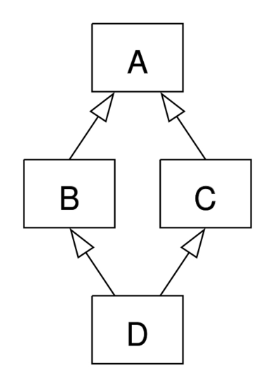

# OOP2

## 상속

기존 클래스의 속성과 메서드를 물려받아 새로운 하위 클래스를 생성하는 것

### 상속이 필요한 이유
1. 코드 재사용
    - 상속을 통해 기존 클래스의 속성과 메서드를 재사용할 수 있음
    - 새로운 클래스를 작성할 때 기존 클래스의 기능을 그대로 활용할 수 있으며, 중복된 코드를 줄일 수 있음

2. 계층 구조
    - 상속을 통해 클래스들 간의 계층 구조를 형성할 수 있음
    - 부모 클래스와 자식 클래스 간의 관계를 표현하고, 더 구체적인 클래스를 만들 수 있음

3. 유지 보수의 용이성
    - 상속을 통해 기존 클래스의 수정이 필요한 경우, 해당 클래스만 수정하면 되므로 유지 보수가 용이해짐
    - 코드의 일관성을 유지하고, 수정이 필요한 범위를 최소화할 수 있음

## 클래스 상속

### super()

부모 클래스 객체를 반환하는 내장 함수   
-> 다중 상속 시 MRO를 기반으로 현재 클래스가 상속하는 모든 부모 클래스 중 다음에 호출될 메서드를 결정하여 자동으로 호출

### super()의 사용 사례

1. 단일 상속 구조
    - 명시적으로 이름을 지정하지 않고 부모 클래스를 참조할 수 있으므로, 코드를 더 유지 관리하기 쉽게 만들 수 있음
    - 클래스 이름이 변경되거나 부모 클래스가 교체되어도 super()를 사용하면 코드 수정이 더 적게 필요

2. 다중 상속 구조
    - MRO에 따른 메서드 호출
    - 복잡한 다중 상속 구조에서 발생할 수 있는 문제를 방지

## 다중 상속

- 둘 이상의 상위 클래스로부터 여러 행동이나 특징을 상속받을 수 있는 것
- 상속받은 코든 클래스의 요소를 활용 가능함
- 중복된 속성이나 메서드가 있는 경우 상속 순서에 의해 결정됨

### 상속이 중복될 때

- MRO 알고리즘을 사용하여 클래스 목록을 생성
- 1 깊이 우선으로, 2 왼쪽에서 오른족으로, 같은 클래스는 두 번 검색하지 않음
- D 에서 발견되지 않으면, B에서, 그다음 C에서 찾음

### MRO(메서드 결정 순서)

mro()
- 해당 인스턴스의 클래스가 어떤 부모 클래스를 가지는지 확인하는 메서드
- 기존의 인스턴스 -> 클래스 순으로 이름 공간을 탐색하는 과정에서 상속 관계에 있으면 인스턴스 -> 자식 클래스 -> 부모 클래스로 확장

### MRO가 필요한 이유

- 부모 클래스들이 여러 번 액세스 되지 않도록, 각 클래스에서 지정된 왼쪽에서 오른쪽으로 가는 순서를 보존하고, 각 부모를 오직 한 번만 호출하고, 부모드르이 우선순위에 영향을 주지 않으면서 서브 클래스를 만드는 단조적인 구조 형성

    -> 프로그래밍 언어의 신뢰성 있고 확장성 있는 클래스를 설계할 수 있도록 도움   
    ->클래스 간의 메서드 호출 순서가 예측 가능하게 유지되며, 코드의 재사용성과 유지보수성이 향상
